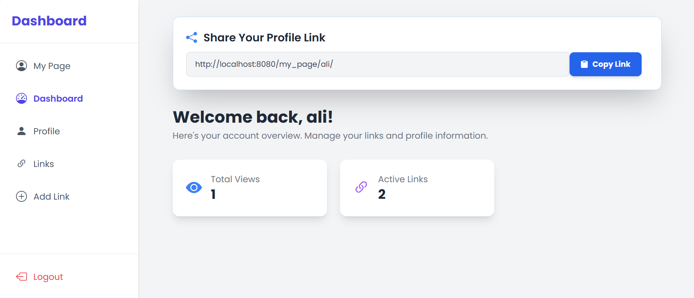

# LinkHub Project

LinkHub is a fully-featured web application built using Python and Django, designed to allow users to manage and share their links efficiently.

<div align="center">
  
</div>
<span>
-----------------------------------------------------------------------------------------------------------------------</span>
<div align="center">
  
</div>

## Features

### User Management (Accounts App)

* **User Registration & Login**: Users can sign up and log in to the platform.
* **Profile Management**: Users have personal profiles which they can update (avatar, username, email, etc.).

### Link Management (Links App)

* **Dashboard**: A personalized dashboard for users to manage their links.
* **Create, Update, Delete Links**: Users can add, edit, delete, and view their links.
* **My Page**: Each user has a public `my_page` which lists all their links.
* **Shareable Links**: Users can copy their page link and share it with friends or on social media.

### Technology Stack

* **Python & Django**: Backend development.
* **NGINX & Gunicorn**: Production-ready deployment.
* **Docker**: Containerization of the application.
* **Logging**: All logs are stored using Django logging configuration.
* **Middleware Rate Limiting**: Limits the number of requests per user/IP using `RateLimitMiddleware`.
* **Testing**: Unit tests written using `pytest`.
* **Load Testing**: Locust file included for performance testing.

## Project Structure

```
linkhub/
├── accounts/        # Handles user registration, login, profile
├── links/           # Handles link creation, update, delete, and sharing
├── docker/          # Docker configuration files
├── nginx/           # Nginx configuration
├── locustfile.py    # Locust load testing script
├── manage.py
└── requirements.txt
```

## Installation & Setup

1. **Clone the repository:**

   ```bash
   git clone https://github.com/Esmat434/LinkHub.git
   cd LinkHub
   ```

2. **Build Docker containers:**

   ```bash
   docker-compose build
   ```

3. **Start the services:**

   ```bash
   docker-compose up
   ```

4. **Apply migrations:**

   ```bash
   docker exec linkhub python manage.py migrate
   ```

5. **Create superuser (optional):**

   ```bash
   docker exec -it linkhub python manage.py createsuperuser
   ```

6. **Access the app:**

   * Web: `http://localhost:8080`
   * Nginx reverse proxy: `http://localhost`

## Usage

* **Register & Login**: Users can create an account and log in.
* **Dashboard**: View active links and total page views.
* **Manage Links**: Add, update, delete, or view links from the dashboard.
* **My Page**: Shareable public page containing all links.

## Rate Limiting

* Authenticated users: 50 requests per minute.
* Anonymous users: 100 requests per minute.
* Configured via `RateLimitMiddleware`.

## Testing

* **Unit Testing**: Run `pytest` to execute all tests.

  ```bash
  docker exec linkhub pytest accounts/tests
  docker exec linkhub pytest links/tests
  ```
* **Load Testing**: Use Locust to simulate traffic.

  ```bash
  locust -f locustfile.py
  ```

## Logging

* Application logs are handled via Django logging and stored according to settings.

## Notes

* Designed as a production-ready, fully containerized web app.
* Allows users to share their link page publicly without requiring others to log in.

## License

* Proprietary project for commercial use.

---